# Presupuesto de una Casa usando JSON Server

**Autor:**

- Kevin Johan Jimenez Delgado

## Pasos para la correcta instalación de node usando Windows

- En primer lugar se debe saber si se tiene instalado node, colocando la siguiente instrucción en el terminal de la computadora o visual studio code `node --version`, en caso de que salga error o salga una versión menos que la "18.18.0", se hace lo siguiente:

- Si se tiene un node menor al recomendado, se recomienda desinstalarlo desde el panel de control->Desinstalar un programa-> Desintalar node; luego para instalar la ultima versión se debe ir a la página de node e instalar la versión que se desea usar `https://nodejs.org/es/download`, obviamente que sea "18.18.0"
## Pasos para la correcta instalación de node usando Linux

- En primer lugar se debe saber si se tiene instalado node, colocando la siguiente instrucción en el terminal de la computadora o visual studio code `node --version`, en caso de que salga error o salga una versión menos que la "18.18.0", se coloca la siguiente instrucción para instalar node en una versión correcta de funcionamiento `nvm install 18.18.0`, luego en visual studio code, en el fichero donde se vaya a trabajar, se va a la terminal y se coloca `npm i`

## Primera configuración en Node para tu proyecto

- Colocar la siguiente instrucción para introducir node en la ruta donde vas a trabajar, `npm init -y`  
- Luego en la consola saldrá lo siguiente, muy parecido pero no saldrá igual, igual este se vera en un archivo llamado "package.json" en tu fichero
```
{
  "name": "presupuestocasaennode",
  "version": "1.0.0",
  "description": "**Autor:**",
  "main": "main.js",
  "scripts": {
    "test": "echo \"Error: no test specified\" && exit 1"
  },
  "keywords": [],
  "author": "",
  "license": "ISC"
}
```
Edita los campos en la parte de autor por tu nombre y asegurate que tengas el AUTOGUARDADO, adicional agrega una linea la del type, entonces se debería ver el archivo "package.json" de la siguiente forma. 
```
{
  "name": "presupuestocasaennode",
  "version": "1.0.0",
  "description": "**Autor:**",
  "main": "main.js",
  "type": "module",
  "scripts": {
    "test": "echo \"Error: no test specified\" && exit 1"
  },
  "keywords": [],
  "author": "Kevin JJ",
  "license": "ISC"
}
```

- Coloca la siguiente instrucción para ya añadir node a tu fichero local `npm -E -D install json-server`, ahí empieza una instalación y esta instrucción es para hacer una versión estable (NOTA: NO tocar las carpetas de node.modules ni "package-lock.son" que se crean): 

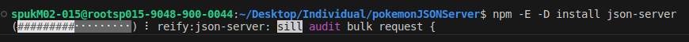

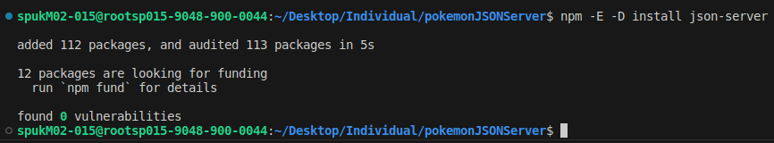

- Crear un archivo en el fichero llamado "db.json", con la siguiente linea de código:
```
 {
    "libros":[],
    "casa":[],
    "papeles":[]
}
```
como notaras en el archivo "package.json", este ha cambiado, le vamos a editar la parte de scripts y dejarlo parecido a este:
```
{
  "name": "presupuestocasaennode",
  "version": "1.0.0",
  "description": "**Autor:**",
  "main": "main.js",
  "type": "module",
  "scripts": {
    "dev": "json-server --watch db.json"
  },
  "keywords": [],
  "author": "Kevin JJ",
  "license": "ISC",
  "devDependencies": {
    "json-server": "0.17.3"
  }
}
```
Por ultimo colocar la siguiente línea de comando `npm run dev`, y debería verse lo de que aparece en db.json, en la parte de resources aparece un link que al final aparece libros, casa, papeles y lo que se edite en vivo con el "db.json" se podrá evidenciar en esos links. Para salir del en vivo con CTRL+C en la terminal

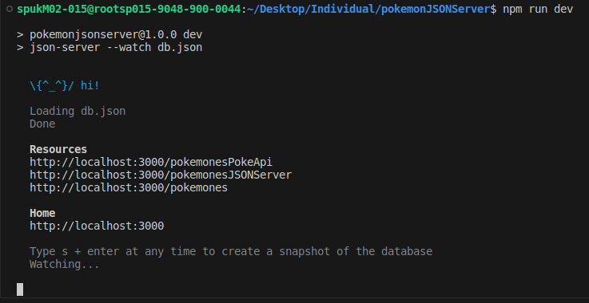


- Con npm corriendo, podemos usar node en otra terminal y colocar el comando `node main.js` para ver los resultados en consola desde Visual Studio Code y desde ahí poder trabajar

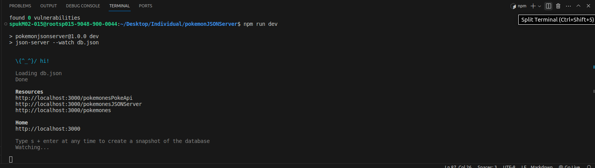

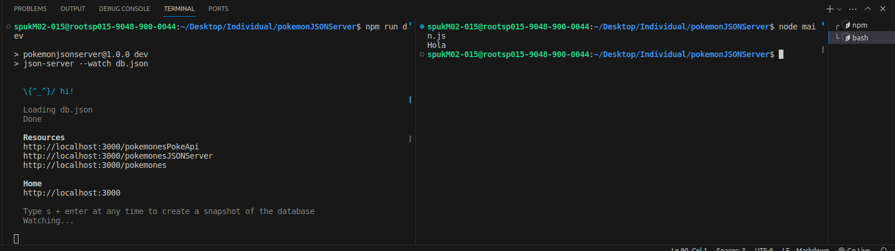

## Ignorar algunos archivos antes de subir al git

- Antes de subir al repositorio y para evitar conflictos, en la carpeta donde se esta trabajando se debe crear un archivo `.gitignore` y dentro de él colocar las carpetas que no desean que se suban al git para evitar conflictos, obligatoriamente deben estar las que se muestran a continuación:

```
node_modules
package-lock.json
```

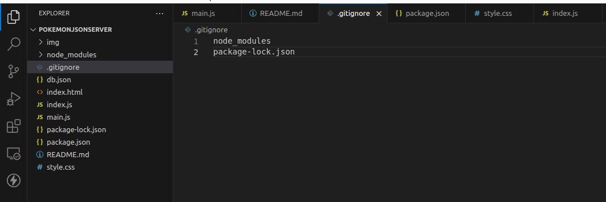

- Con esto ya se puede subir todo al GitHub

## Clonar desde el repositorio

- Si se desea trabajar el proyecto, se debe clonar obviamente donde se desea trabajar o fichero deseado, en la terminal de Visual Studio Code con `git clone <url>` y luego de eso invocar el siguiente comando `npm i` en el lugar donde el fichero descargo todo de GitHub. Ya con eso se puede invocar el comando `npm run dev` para trabajar desde el repositorio clonado.

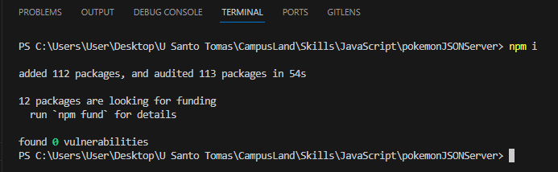

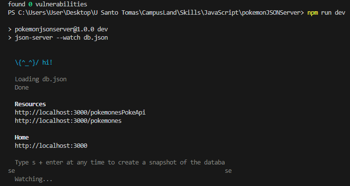

## Descripción del Proyecto

Este proyecto permite administrar un presupuesto de una casa a través de JSON Server `http://localhost:3000/libros`. Las principales funcionalidades incluyen la búsqueda, creación, edición, eliminación y actualización de registros por medio de una ID. Además, se muestra el total de los ingresos y egresos.

## Tecnologías Utilizadas

- HTML
- CSS
- JavaScript
- JSON Server
- Métodos como PUSH, DELETE, POST, etc.
- Eventos de escucha como addEventListener

## Instrucciones de Uso

1. En la carpeta donde se tienen todos los elementos, ir al terminal y ejecutar la linea `npm run dev`

2. Abre el archivo `index.html` en tu navegador para visualizar el proyecto con open with live server.

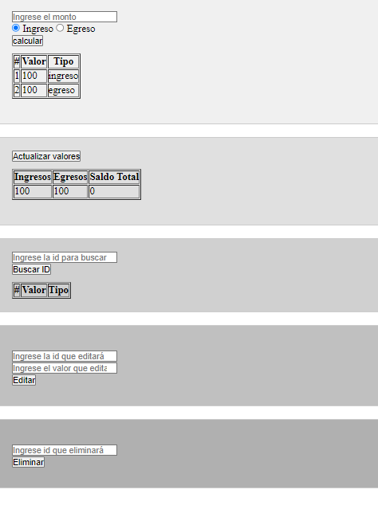

3. Para realizar acciones en el presupuesto de la casa, utiliza las siguientes funcionalidades:

   - **Buscar ID:** Ingresa una ID en el formulario de búsqueda y haz clic en "Buscar ID" para encontrar registros existentes.

   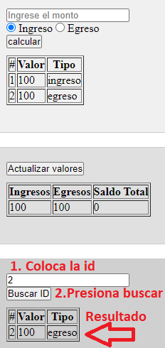

   - **Crear Registro:** Completa el formulario con un monto, selecciona el tipo (Ingreso o Egreso) y haz clic en "Calcular" para agregar un nuevo registro.

    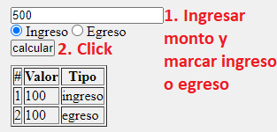

    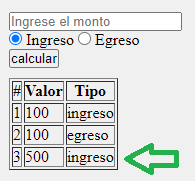

   - **Editar Registro:** En el formulario de edición, ingresa la ID que deseas editar y el nuevo valor (monto). Luego, haz clic en "Editar" para actualizar la ID con el nuevo valor.

   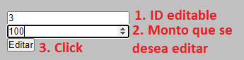

   Al hacerse el cambio se notará en la tabla de todos los datos, y también en el del monto total

   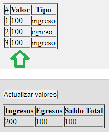

   - **Eliminar Registro:** En el formulario de eliminación, ingresa la ID que deseas eliminar y haz clic en "Eliminar" para eliminar el registro correspondiente.

   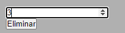

   Al hacerse el cambio se notará en la tabla de todos los datos, y también en el del monto total

   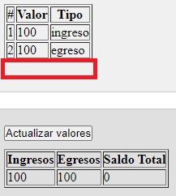

   - **Actualizar Valores:** Utiliza el botón "Actualizar Valores" para reflejar los cambios en la página después de realizar acciones de creación, edición o eliminación de registros.

   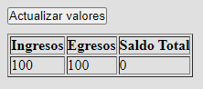

## NOTA

- **Actualizar Valores:** Utiliza el botón "Actualizar Valores" para reflejar los cambios en la página después de realizar acciones de creación, edición o eliminación de registros.

- **Ver proyecto:** Abrir con ver en vivo u open with live server